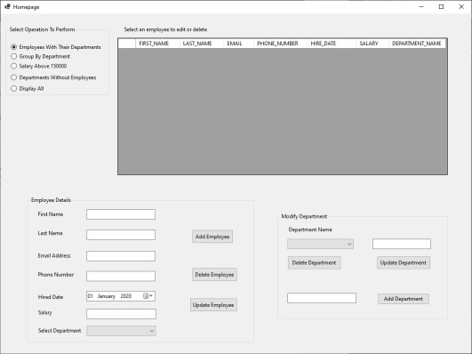

# Company Records
 - A mini windows desktop application
 - Implements CRUD operations for employees and departments
 
 ## Running Application
 Before starting, Visual Studio 2019 and Microsoft SQL Server Management Studio 18 must be installed on PC
 - Open solution file with Visual Studio
 - Install necessary nuget packages
 - In Solution Explorer right click on Company.Data and select Set as Startup Project
 - On Package Manager Console, set Default Project to Company.Data then run `Update-database`
 - In Solution Explorer right click on Company.Desktop and select Set as Startup Project
 - Start Application from the Debug Menu on File Menu Bar or press `F5`
 
 
 Preview of the Desktop Application
